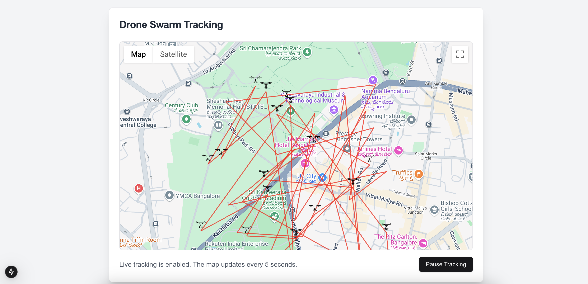
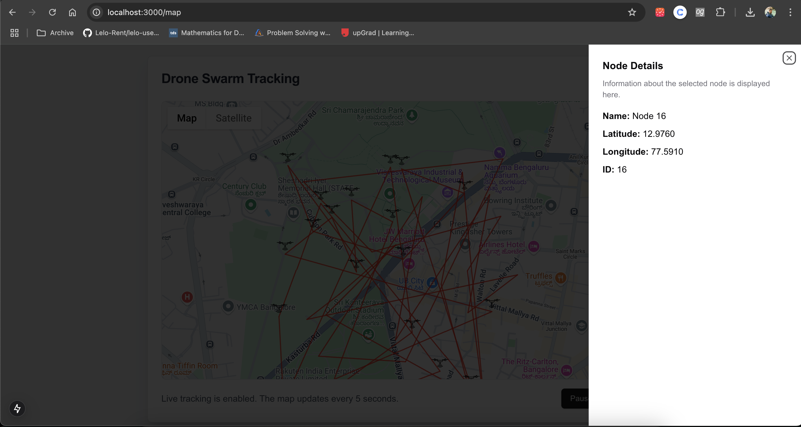

# Google Maps Graph

This project demonstrates a graph using **Google Maps API** and a side panel to display individual node information.


## How it looks



------



---


## 🚀 How to Run the Project

### Prerequisites

1. **Node.js**: Ensure Node.js (v16+) is installed.
2. **Google Maps API Key**: Get an API key from the [Google Cloud Console](https://console.cloud.google.com/).
3. **Environment Variables**: Create a `.env.local` file in the project root.

### Installation

1. Clone the repository:
   ```bash
   git clone https://github.com/yourusername/drone-swarm-tracking.git
   cd drone-swarm-tracking
   ```

2. Install dependencies:
   ```bash
   npm install
   ```

3. Add your Google Maps API key to `.env.local`:
   ```bash
   NEXT_PUBLIC_GOOGLE_MAPS_API_KEY=your-google-maps-api-key
   ```

### Run the Project

1. Start the development server:
   ```bash
   npm run dev
   ```

2. Open your browser and visit:
   ```
   http://localhost:3000/map
   ```

---

## 📝 High-Level Overview

### Project Features

1. **Google Maps Integration**:
   - Displays a map with drone nodes represented as markers.
   - Uses Google Maps API for real-time visualization.

2. **Dynamic Updates**:
   - The map fetches swarm data from a mock API every 5 seconds (when tracking is enabled).

3. **Shadcn Side Panel**:
   - Clicking on a marker opens a side panel with detailed information about the node.

4. **Pause/Resume Tracking**:
   - Tracking can be toggled, pausing the periodic updates.

---

### How It Works

1. **Frontend**:
   - Built with **Next.js** (App Router) and integrates **Google Maps API**.
   - The `GraphMapSwarm` component fetches data from the API and dynamically renders markers and polylines (connections between nodes).

2. **Swarm Data**:
   - Nodes represent drones with latitude, longitude, and unique identifiers.
   - Edges connect the nodes to form a swarm pattern.

3. **Shadcn UI**:
   - Side panel (`Sheet`) displays dynamic details about the selected drone when a marker is clicked.

---

## 🔧 Mocking API Data

The mock API serves dynamic swarm data for demo purposes. Here’s how it works:

### API Route: `/api/swarm-coordinates`

This API generates a list of drones with randomized coordinates around a central location.

#### Code for Mock API (`app/api/swarm-coordinates/route.js`):
```javascript
import { NextResponse } from "next/server";

export async function GET() {
  const centralLat = 12.9716;
  const centralLng = 77.5946;
  const radius = 0.005;

  const nodes = Array.from({ length: 10 }, (_, i) => ({
    id: i + 1,
    name: `Node ${i + 1}`,
    lat: centralLat + (Math.random() * radius * 2 - radius),
    lng: centralLng + (Math.random() * radius * 2 - radius),
  }));

  return NextResponse.json(nodes);
}
```

### How to Modify Mock Data
- **Number of Drones**: Change the `Array.from` length (e.g., `{ length: 20 }` for 20 drones).
- **Swarm Radius**: Adjust the `radius` variable for a tighter or wider swarm.
- **Central Location**: Modify `centralLat` and `centralLng` for a different center point.

---

## 🎨 Project Structure

- **`app/map/page.jsx`**: Main page rendering the `GraphMapSwarm` component.
- **`components/GraphMapSwarm.jsx`**: Core map visualization logic.
- **`components/ui`**: Shadcn UI components (e.g., `Sheet`, `Button`).
- **`app/api/swarm-coordinates/route.js`**: Mock API for generating dynamic swarm data.

---

## 🛠 Customization

1. **Marker Icons**:
   - Replace the `"/marker.svg"` file with a custom icon.
   - Update the size or design in the `icon` configuration.

2. **Update Interval**:
   - Modify the `setInterval` in `GraphMapSwarm` to change the frequency of updates.
